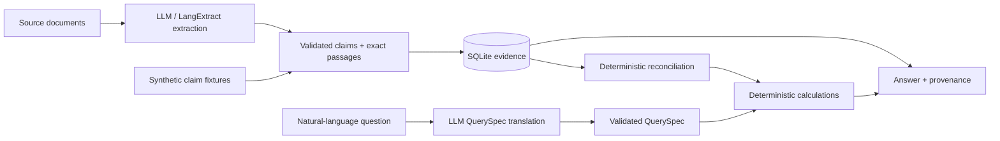

# Clinical Evidence Reconciliation Engine

A Python engine for turning conflicting clinical-document claims into auditable
patient-level answers. It preserves exact source passages, applies explicit corrections,
and calculates care utilization without asking a language model to do arithmetic.

The engineering focus is the boundary between **semantic extraction** and
**deterministic reconciliation, calculation, and evidence tracing**. A visit can span
several documents; a later copy should not undo a signed correction, and contradictory
authoritative claims should remain visible.

## Run the synthetic demo

Python 3.12+ is required; verified with 3.12.14. Run from the repository root.
Dependency installation needs a package index or populated cache. Once installed,
the demo and default tests need no credentials, network, or live model access.

```sh
python -m venv .venv
# PowerShell: .venv\Scripts\Activate.ps1
# POSIX: source .venv/bin/activate
python -m pip install -r requirements.lock
python -m pip install --no-deps .
clinical --db artifacts/demo.sqlite demo
clinical --db artifacts/demo.sqlite query --patient DEMO-CEDAR --family utilization --format audit
clinical --db artifacts/demo.sqlite query --patient DEMO-JUNIPER --family utilization
python -m pytest -q
```

`python -m clinical_intelligence` is equivalent to `clinical`. Global `--db` and
`--output` precede subcommands. Running `demo` again reuses persisted evidence.
Generated databases and expanded outputs stay local under ignored `artifacts/`.

## Architecture



- **Extraction:** the model records what each document states; Pydantic validates
  contracts and the adapter verifies contiguous verbatim spans and character offsets.
- **Reconciliation:** patient-scoped encounter matching, field-specific corrections,
  retransmission relationships, and unresolved alternatives are ordinary Python rules.
- **Calculation:** half-open local-time intervals are unioned and intersecting breaks
  subtracted; encounter/day counts and plan comparisons use the reconciled evidence.
- **Provenance:** one evidence index links answer contributions to calculations,
  events, claim fields, source passages, and filenames. JSON and audit use the same result.
- **Persistence:** content hashes deduplicate documents; versioned extraction snapshots
  are immutable. Patient caches depend on active evidence and policy versions and survive restarts.

## One concrete evidence chain

The eight [synthetic documents](examples/synthetic/documents) describe two independent
patients in April 2026. They are engineering fixtures, not real clinical records.

For Cedar's `LAB-G7`, attendance states **09:12–10:46**, a separate activity record
states a **09:41–09:49** pause, and a signed correction replaces departure with **10:31**.
A subsequent copy repeats the old departure. Grounded claims preserve each statement;
reconciliation retains the correction; calculation yields **79 − 8 = 71 minutes**;
the audit links arrival, corrected departure, and pause to their respective source passages.

Cedar's second encounter has unresolved signed **37 / 49 minute** claims, so totals
remain **108 / 120 minutes across two encounters and two days**. A 115-minute weekly
plan cannot be conclusively assessed. Juniper has **one encounter / 23 minutes**, even
though the encounter token overlaps Cedar's. Duplicate ingestion changes neither total.

## Correctness and evaluation

```sh
clinical --db artifacts/demo.sqlite query --patient DEMO-CEDAR --family compliance --format audit
clinical --db artifacts/demo.sqlite experiment
clinical --db artifacts/demo.sqlite benchmark --iterations 5
```

The offline suite covers exact grounding, patient isolation, deduplication, corrections,
retransmissions, conflicts, interval arithmetic, persistence in a new interpreter,
QuerySpec behavior, and runtime provenance. It also exercises real LangExtract alignment
with a fixed model response. Synthetic clock expectations use independent datetime arithmetic.

[Evaluation](docs/evaluation.md) records actual results, a reproducible comparison with
naive latest-record selection, benchmark boundaries, and the earlier live extraction
failure. Fixture/replay success is not a measure of live model accuracy.

## Live model workflow

Install and authenticate Codex CLI separately and put it on PATH. The provider uses
`gpt-6-luna` with high reasoning and the tested `clinical_partition` configuration;
typed extraction is followed by a dedicated clinical-observation pass, with at most
one repair triggered by runtime validation. Live commands
require the operator's account and network. No credentials or model weights are included.

```sh
clinical --db artifacts/live.sqlite process --input examples/synthetic/documents --model gpt-6-luna --reasoning high
clinical --db artifacts/live.sqlite query --patient DEMO-CEDAR --family utilization --format audit
python tools/validate_live.py artifacts/live.sqlite
clinical --db artifacts/demo.sqlite ask --patient DEMO-CEDAR "How many therapy minutes were delivered from April 6 through April 12, 2026?"
```

`process --extractor baseline` retains the historical string-payload prompt for
comparison and rollback. Use a separate database. [The Luna optimization report](docs/luna-optimization-report.md)
documents 42 tested configurations, real independent repetitions, a frozen holdout,
residual failures, and exact reproduction commands. [The aggregate summary](docs/luna-results-summary.json)
records final comparisons, call accounting and holdout limitations. Full experiment
history remains local; live calls are distinguished from offline replay and cache reuse. Raw original materials, responses, and databases remain
in ignored `artifacts/` and are not publication-approved.

`validate_live.py` compares reconstructed encounters with the synthetic fact fixtures
and exits nonzero on differences. `ask` proposes a validated QuerySpec; the engine
calculates the answer. Unsupported or ambiguous interpretations have explicit states.
Manual queries support utilization, weekly utilization, compliance, encounters,
period comparison, consecutive under-target weeks, assessments, progress, and cohort thresholds.

## Limitations

The earlier live run omitted an activity encounter ID and failed the semantic comparison;
it is retained as a historical failure. The optimized default passed the public synthetic
encounter comparison through the real CLI, while repeated original-task extraction still
showed copied-record, presence, role, and clinical-coverage errors. The frozen holdout also
exposed annotation/wording inconsistencies; its original scores are preserved in the report.
These are engineering measurements, not clinical validation. The current plan-field locator
misses wording such as "115 patient-present minutes", so compliance provenance reports
partial coverage even though the full plan quote remains available.

The engine assumes one patient per document, explicit encounter identities, same-day
local intervals, and quantitative Monday–Sunday plans. Missing midweek applicability
rules remain ambiguous. The baseline live extractor does not emit functional-action
claims, and neither does the optimized contract; structured stored actions are supported
by the domain and progress queries. Missing dates and scores are represented explicitly,
with undated facts and uncertain bounds retained rather than invented dates or zero scores.
Exact quotation does not guarantee semantic accuracy. Whole-patient loads and detailed
evidence output constrain scale; no large-corpus throughput is demonstrated. There is
no production deployment, real-patient validation, regulatory certification, fine-tuning,
or autonomous medical decision-making claim.

## License and attribution

Source-available under [PolyForm Noncommercial License 1.0.0](LICENSE.md).
Noncommercial use, modification, and redistribution are permitted subject to its
conditions. Commercial use requires separate permission or licensing from the relevant
copyright holder. Specified notices must be preserved, including [NOTICE](NOTICE):

Required Notice: Copyright (c) 2026 The-Veridis-Lion

This applies only to original material owned and licensable by The-Veridis-Lion;
it does not claim ownership of external dependencies or excluded third-party inputs.
This is not described as OSI-approved open source. [Third-party notices](THIRD_PARTY_NOTICES.md)
preserve dependency attribution and LangExtract health-use terms. AI coding assistance
supported implementation and verification; runtime inference is separately identified.

## Contact

For project inquiries or commercial licensing:

[theveridislion@duck.com](mailto:theveridislion@duck.com)

The-Veridis-Lion
