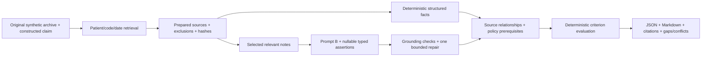

# Clinical Evidence Engine

An evidence-first Python backend that turns synthetic longitudinal records and
clinical notes into traceable HbA1c evidence-review packets. It combines
source-preserving retrieval, typed GPT-6 Luna extraction, and deterministic
policy checks while retaining missing information and conflicting sources.

## Results at a Glance

| Demonstrated result | Scope and evidence |
| --- | --- |
| **389 offline regression tests passed** | Fresh release check; live network/provider dispatch blocked |
| **350 words per source note on average** | 12 distinct constructed synthetic notes; 155–707 words, median 197 |
| **$0.00301 estimated inference cost per document workflow** | 24 B runs, including four repairs; Standard API equivalent, not an observed subscription bill |
| **20.15 seconds per workflow on average** | Recorded sequential workflow duration; not production throughput |
| **26/26 expected retrieval source-task pairs** | Original Synthea archive, three overlapping windows for one patient; 19 unique HbA1c rows |
| **Original Prompt B is the normal default** | Ordinary CLI, public Python API, and request builder; A is an explicit fallback |

B-only usage was **498,270 input / 44,704 output tokens across 28 requests**.
At [GPT-6 Luna Standard pricing](https://developers.openai.com/api/docs/models/gpt-6-luna)
($0.10 input / $0.50 output per million tokens), the calculated total is
**$0.072179 for 24 runs**, without cached-input discounts. Reasoning tokens are
already included in output. These are engineering measurements on synthetic
sources, not clinical accuracy, payment decisions, or production-scale claims.
See [per-note and per-run measurements](docs/release-measurements.md).

## Engineering Architecture



- **Retrieval:** streams original CSV tables using patient, code, encounter, and
  temporal constraints. Original row values, locators, hashes, and exclusion
  reasons survive preparation. Optional archive verification reopens the ZIP.
- **Extraction:** Pydantic contracts express unknown values as null. The model
  proposes source-supported facts and span IDs; code assigns internal identities
  and exact offsets. A quoted passage is traceable evidence, not a semantic proof.
- **Rules:** field-scoped amendments and explicit relationships produce an
  auditable derived view without overwriting original facts. Policy applicability
  is separate from what the clinical evidence establishes.
- **Review:** four scoped criteria—monitoring context, test timeline, short-interval
  rationale, and order intent—produce evidence states. `SUPPORTED` applies to one
  criterion; it never means an approved claim.

### Why GPT-6 Luna and Prompt B?

Luna is used for a bounded text-to-facts task, with measured token usage and high
reasoning held fixed. Original B organizes instructions around propositions,
actors, events, date roles, and evidence. It improved selected date/authentication
fields in saved comparisons, but also produced unsupported nonoccurrence claims.
Shared validation can reject supported facts. B is a chosen **research default**,
not a finding that all of its clinical interpretations are correct.

The optional Scope Audit prototype is **not included in this release**. Its
experimental projection regressed criterion matches from 63/64 to 55/64 and
removed genuine conflicts. It remains on `feature/b-default-semantic-safety`.
See the [engineering case study](docs/engineering-case-study.md) for failures,
evaluation boundaries, and architecture trade-offs.

## Zero-Model-Call Demo

Python 3.12+ is required. Installation needs a package index or populated cache;
the following review commands need no credentials or model access.

```sh
python -m venv .venv
# PowerShell: .venv\Scripts\Activate.ps1
# POSIX: source .venv/bin/activate
python -m pip install -r requirements.lock
python -m pip install --no-deps .
python -m clinical_intelligence.claims_review run --case examples/claims_review/development/DEV-002.json --mode structured-only --format json --output artifacts/review.json
python -m clinical_intelligence.claims_review render --packet artifacts/review.json --format summary --output artifacts/review.md
```

Structured-only mode deliberately leaves free-text notes unprocessed and reports
that limitation. [The example archive packet](examples/claims_review/raw/review-summary.md)
also shows honest gaps: an observed prior result does not establish target
performance, physician intent, or a verified billing claim.

### Start from an Original, Unfiltered Archive

```sh
python -m clinical_intelligence.claims_review download --output artifacts/raw-source/original.zip
python -m clinical_intelligence.claims_review retrieve --archive artifacts/raw-source/original.zip --query examples/claims_review/raw/target-query.json --output artifacts/raw-source/retrieval.json
python -m clinical_intelligence.claims_review run --retrieval artifacts/raw-source/retrieval.json --verify-archive artifacts/raw-source/original.zip --mode structured-only --format summary --output artifacts/raw-source/review.md
```

Download uses the official Synthea distribution and refuses to overwrite an
existing archive. The `latest` archive can change: inspect the generated manifest
and do not assume it matches the recorded SHA. Without a receipt declaration,
source availability stays unknown; download time never establishes original EHR
availability or complete history. The historical retrieval benchmark used an
18-table, 201,657-row snapshot. Its fixed oracle requires the recorded archive
hash; see [retrieval instructions and boundaries](docs/raw-source-delivery.md).
The full ZIP, expanded outputs, and databases remain ignored.

## Explicit Live Usage and Rollback

Install and authenticate Codex CLI separately. **This command makes real requests**
and consumes the shared persistent ledger. Preserve its path across restarts;
do not delete or reset an exhausted historical ledger. Each note can use its
initial request plus at most one existing validation repair.

```sh
python -m clinical_intelligence.claims_review run --case examples/claims_review/development/DEV-002.json --mode live --model gpt-6-luna --reasoning high --ledger artifacts/claims-review/live-budget.json --trace-directory artifacts/claims-review/live-calls --format markdown --output artifacts/live-review.md
```

Omitting `--note-prompt` selects original B. Add `--note-prompt A` for explicit
fallback; public `run_review(..., note_prompt="A")` does the same. Default requests
and packet identities record the selected prompt hash. No credentials, weights,
raw private experiment responses, or patient records are included.

## Therapy Reconciliation Remains Available

The original therapy engine retains independent SQLite evidence, explicit
corrections, retransmissions, unknowns, and unresolved signed alternatives.
Time conversion, interval union, break subtraction, and utilization remain
ordinary deterministic Python operations.

```sh
clinical --db artifacts/demo.sqlite demo
clinical --db artifacts/demo.sqlite query --patient DEMO-CEDAR --family utilization --format audit
clinical --db artifacts/demo.sqlite query --patient DEMO-JUNIPER --family utilization
```

The synthetic demo keeps a corrected 71-minute encounter despite a later copy,
and retains signed 37/49-minute alternatives: Cedar totals remain **108/120
minutes**, while Juniper has **23 minutes**. See [therapy evaluation](docs/evaluation.md)
and the [nullable extraction contract](docs/uncertainty-contract-v1.md).

## Verification and Limits

```sh
python -m pytest -q
```

Release validation includes installed CLI execution and intercepted B-default/A-
fallback requests. Software tests, injected fixtures, saved-response replay,
original-archive retrieval, and actual Luna measurements are reported separately.
The historical reserved six-case confirmation achieved **3/6 complete cases and
16/24 matching criterion states**. Those cases are now exposed regression material.
A later finite A/B benchmark had scoring ambiguities; its counts are not validated
clinical precision/recall. Semantic citation precision remains unavailable.

The policy registry is `draft_ai_reviewed`; human and clinical-expert review are
not completed. Three-calendar-month comparison is a program convention, not the
complete CMS medical-necessity rule. Known limitations include source/subject
confusion, unsupported definite values, unnecessary unknowns, restrictive
validator/repair behavior, and unresolved event linkage. No real-patient
validation, autonomous adjudication, compliance certification, or production
scalability is claimed. See the [technical design and evaluation](docs/engineering-case-study.md)
for architecture, measurements, and known failure modes.

## License and Contact

Source-available under [PolyForm Noncommercial 1.0.0](LICENSE.md); commercial use
requires separate permission. Preserve [NOTICE](NOTICE) and
[third-party notices](THIRD_PARTY_NOTICES.md). This is not represented as
OSI-approved open source.

Required Notice: Copyright (c) 2026 The-Veridis-Lion

Contact: [theveridislion@duck.com](mailto:theveridislion@duck.com).
