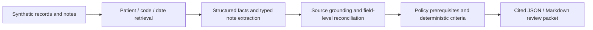

# Clinical Evidence Engine

**An evidence-first Python backend that turns fragmented synthetic clinical records into auditable, source-linked evidence reviews.**

The current workflow focuses on **HbA1c monitoring**: retrieving relevant history, extracting supported facts from clinical notes, reconciling corrections and conflicts, and reporting what can—or cannot—be established. It prepares evidence for **further review**, not automatic claim approval or denial.

## What It Does

- **Retrieval with provenance:** filters original Synthea CSV records by patient, code, and date while retaining original values, row locations, hashes, and exclusions.
- **Evidence-grounded extraction:** combines deterministic structured-data parsing with typed GPT-6 Luna extraction for selected notes; unknown values stay `null`, and proposed passages must pass source-position checks.
- **Conflict-aware reconciliation:** preserves original records, applies explicit field-level amendments, and refuses to resolve disputed facts merely by choosing the latest record.
- **Scoped review:** evaluates monitoring context, test timeline, short-interval rationale, and provider order intent, producing cited JSON/Markdown packets with evidence states, gaps, and conflicts.

## See It in Action

**A retrieved result is not the same as sufficient evidence.** In the [original-archive example](examples/claims_review/raw/review-summary.md), the engine finds historical HbA1c measurements but cannot establish the requested test's purpose, complete history, or provider intent. A reader-friendly summary of the generated packet is:

```text
Monitoring context        Insufficient evidence
Test timeline             Insufficient evidence
Short-interval rationale  Insufficient evidence
Order intent              Insufficient evidence
Overall                   Needs review
```

These are reader-facing labels; serialized status codes are defined in the versioned [review contract](docs/claims-review-contract.md).

**A correction is not overwritten by a later copy.** In the constructed [REL-04 case](examples/claims_review/reliability_v1/README.md), an authenticated amendment changes an HbA1c event date from **June 6 to August 6, 2026**. A subsequently received copy containing June 6 does not reverse the amendment. With unknown amendment authority (`REL-05`), the system retains uncertainty instead. [Mechanism and validation details](docs/reliability-delivery.md).

## Architecture



**The LLM proposes note facts; deterministic code handles record identity, amendments, applicability, and evidence-state rules.** Original evidence is preserved separately from the derived view. [Engineering case study](docs/engineering-case-study.md).

**Possible next step — targeted model escalation:** when critical evidence is missing, conflicting, or fails grounding checks, a more capable second-pass model could review the relevant original sources before the case is routed onward. This is a design direction, **not an implemented fallback**; any revised assertions would still need source validation.

## Validation Snapshot

- **389 offline regression tests passed** in the documented release check. Live provider/network dispatch was blocked; this is a software test result, not clinical accuracy.
- **26/26 expected retrieval source-task pairs** were found across three overlapping windows **for one synthetic patient** (19 unique HbA1c rows). Not a population-wide recall score.
- **Complete-case validation remains mixed:** small synthetic evaluations identified missing fields and semantic inconsistencies even when criterion-level outcomes matched. The [full case counts and failure analysis](docs/reliability-delivery.md) are preserved in the evaluation reports.
- **20.15 seconds** and **$0.00301 estimated model cost** per workflow, averaged over 24 sequential runs on 12 constructed notes. Neither is production throughput or an observed bill.

These bounded tests do **not** establish semantic citation accuracy, exhaustive clinical fact precision/recall, or real-patient performance. The original [reserved confirmation](docs/confirmation-delivery.md) and [measurement details](docs/release-measurements.md) remain available for inspection.

## Quick Start — No Model Calls

Requires Python 3.12+ and access to pinned packages:

```sh
python -m venv .venv
# Activate: .venv\Scripts\Activate.ps1 (PowerShell) or source .venv/bin/activate (macOS/Linux)
python -m pip install -r requirements.lock
python -m pip install --no-deps .
python -m clinical_intelligence.claims_review run --case examples/claims_review/development/DEV-002.json --mode structured-only --format summary
```

`structured-only` intentionally does **not** process the note; it is a no-inference demonstration, not a reproduction of live-note results.

### Original Archive Evidence Demo

Run against an original Synthea archive:

```sh
python -m clinical_intelligence.claims_review download --output artifacts/raw-source/original.zip
python -m clinical_intelligence.claims_review retrieve --archive artifacts/raw-source/original.zip --query examples/claims_review/raw/target-query.json --output artifacts/raw-source/retrieval.json
python -m clinical_intelligence.claims_review run --retrieval artifacts/raw-source/retrieval.json --verify-archive artifacts/raw-source/original.zip --mode structured-only --format summary
```

[Archive provenance, benchmark, and limitations](docs/raw-source-delivery.md). Live note extraction is **opt-in** (`--mode live`) and requires a separately authenticated Codex CLI, real requests, and a persistent budget ledger. Prompt B is the current default; A is an explicit fallback. [Prompt selection and failure analysis](docs/engineering-case-study.md).

## Related Module: Therapy Reconciliation

A separate SQLite-backed engine handles synthetic therapy evidence, explicit corrections, retransmissions, and uncertain utilization totals. One fixture correctly preserves **108/120 possible minutes** rather than the **135-minute** answer produced by a naïve latest-record rule. [Therapy demo and evaluation](docs/evaluation.md).

```sh
clinical --db artifacts/demo.sqlite demo
clinical --db artifacts/demo.sqlite query --patient DEMO-CEDAR --family utilization --format audit
```

## Where to Find the Details

| Topic | Source |
| --- | --- |
| Complete output example | [Source-linked review packet](examples/claims_review/raw/review-summary.md) |
| Architecture and trade-offs | [Engineering case study](docs/engineering-case-study.md) |
| Reliability, errors, correction cases | [Reliability report](docs/reliability-delivery.md) · [Reserved confirmation](docs/confirmation-delivery.md) |
| Retrieval verification | [Original-source report](docs/raw-source-delivery.md) |
| Exact latency, cost, note lengths, tokens | [Measurement report](docs/release-measurements.md) |
| A/B prompts and historical scoring limits | [Prompt comparison](docs/luna-ab-posthoc-reanalysis.md) · [Prospective follow-up](docs/b-candidate-new-validation.md) |
| Policies and review semantics | [Review contract](docs/claims-review-contract.md) · [Policy verification](docs/claims-review-policy-verification.md) |

## Limitations, License, and Contact

This is a **synthetic-data engineering prototype**, not a clinically validated decision system. Policy rules are narrowly scoped and remain `draft_ai_reviewed`; human and clinical-expert verification are incomplete. Source-grounded quotes do not guarantee correct clinical interpretations. No autonomous adjudication, compliance certification, or production scalability is claimed.

Source-available under [PolyForm Noncommercial 1.0.0](LICENSE.md); commercial use needs separate permission. See [NOTICE](NOTICE) and [third-party notices](THIRD_PARTY_NOTICES.md). Not OSI-approved open source.

Required Notice: Copyright (c) 2026 The-Veridis-Lion  
Contact: [theveridislion@duck.com](mailto:theveridislion@duck.com)
