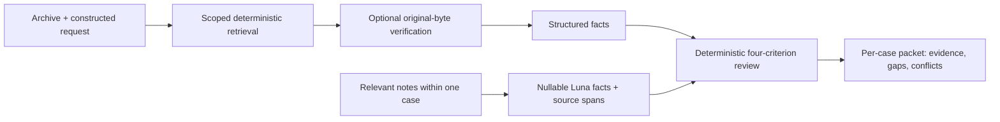

# HbA1c evidence review: engineering case study

**Problem:** build a traceable evidence packet without inventing missing clinical
facts or turning a language model into a payment decision maker.

Patient/source/encounter identities, availability and event dates remain separate.
Unknown is neither false nor zero. Calculations and reconciliation stay in code.
Policy is AI-reviewed draft; SUPPORTED refers only to an evidence criterion.

| Demonstrated evidence | Measurement / boundary |
|---|---|
| Original Synthea retrieval, historical phase | 19 unique result rows; 26/26 overlapping source-task matches for one patient; not clinical accuracy |
| Frozen reserved confirmation, this phase | 3/6 automatic conformance; 16/24 criterion states; five live-note cases and one structured case |
| Actual new inference | Seven Luna/high calls, including two validation repairs; 119,822 input / 10,491 output tokens; billed cost unknown |
| Position/binding audit | 612 citation occurrences, zero failures; semantic precision unavailable |
| Source integrity, post-confirmation | Authentic 60-source snapshot passes; recomputed-digest tamper is rejected in verified mode |
| Regression | 303 frozen tests, then 314 with eleven independent integrity tests; installed-wheel checks pass |

**Audit excerpt:** the first reserved letter used a valid test synonym. Luna initially
identified specificity, but a narrower lexical guard rejected it. Bounded repair changed
the field to null and two criteria became unnecessarily insufficient. The failure is
retained and attributed to validation, rather than labelled as two independent model
omissions. Other blockers are missing-date policy gating and unimplemented targeted
specimen-date amendment handling. No holdout retuning occurred.

**Two independent demos:** RAW-HBA1C-001 uses authentic original CSV rows and zero
Luna calls; the constructed October target lacks documentary performance, intent and
purpose. DEV-002 is a different patient with a short constructed note; its historical
real final-prompt answer demonstrates source-linked implementation and order intent.
Rendering that packet is not fresh inference or an original full-text clinical note.

**60-90 seconds:** show request/archive identity (15 s), retrieval and verified missing-
evidence packet (20 s), switch patients and show the historical note citation (20 s),
show honest reserved metrics and the tamper rejection (20 s), state policy/synthetic/
human-review limitations (15 s). See [execution details](confirmation-delivery.md).

**Interview point:** separate retrieval misses, language interpretation, validation,
rules and provenance. A correct-looking status can hide wrong source meaning, while
an honest missing-source result can be correct. This prototype is suitable for
engineering outreach with disclosed failures; it does not demonstrate reliable complete
medical necessity review, clinical validation or compliance certification.
